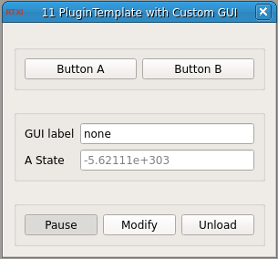

###Plugin Template

**Requirements:** None  
**Limitations:** None  

<!--start-->
This is the plugin template, also known in previous versions as MyPluginGUI. It is designed to provide a simplified interface with which anyone fork into custom RTXI modules. For instructions and tutorials regarding its use, see [the documentation on our website](http://rtxi.org/docs/tutorials/2015/04/15/understanding-plugin-template/). 
<!--end-->

####Paramaters
1. GUI Label - Example parameter

####States
1. A State - An example state
